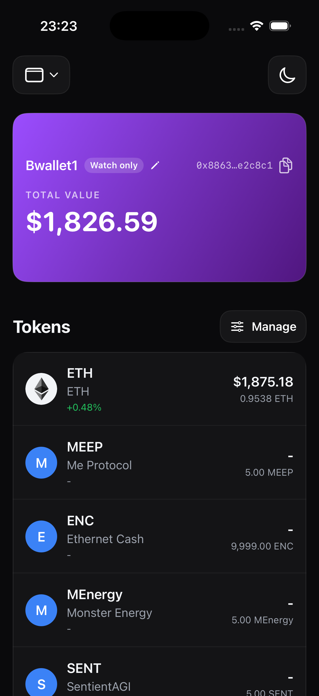
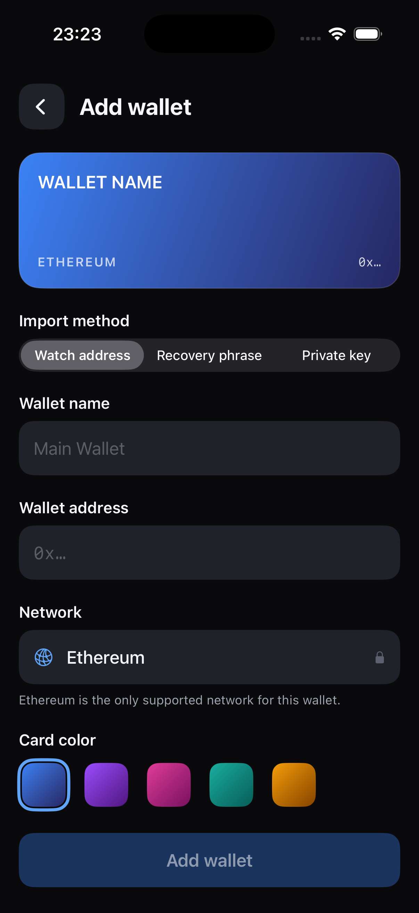
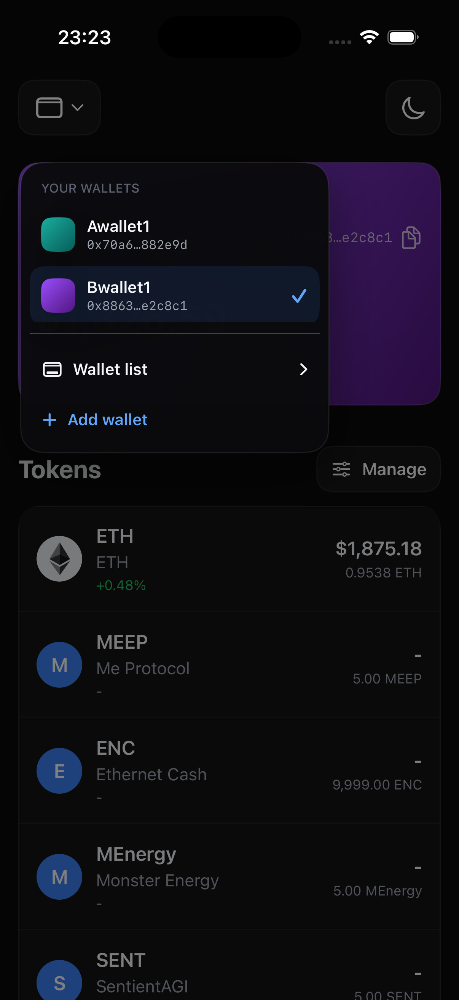
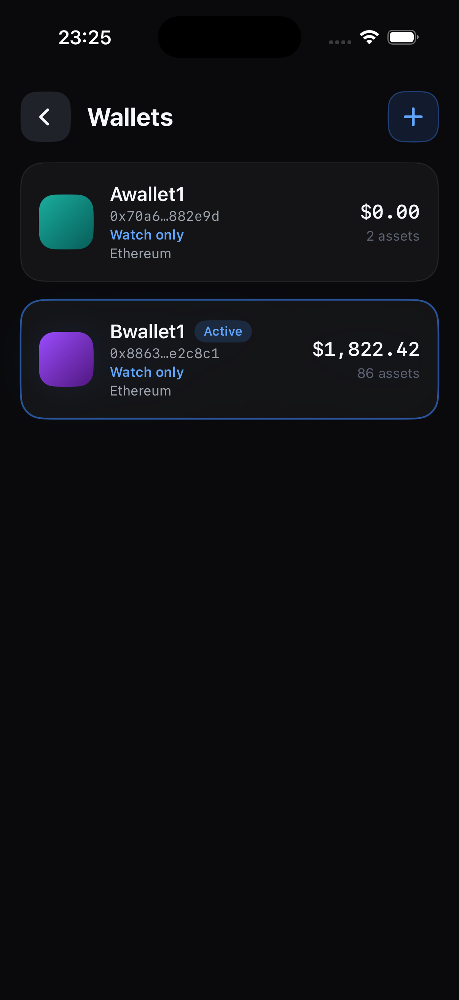

# sevenwallet

An experimental Ethereum wallet and portfolio app for iPhone, built with SwiftUI. It tracks multiple wallets, supports watch-only addresses and protected imports, and presents cache-first token balances with market data from a configured backend.

> [!WARNING]
> Transaction signing, sending, wallet generation, and credential reveal/export are not implemented. The app is not a replacement for your own recovery-phrase or private-key backup.

## Screenshots

<table>
  <tr>
    <td align="center">
      <br>
      <sub>Portfolio</sub>
    </td>
    <td align="center">
      <br>
      <sub>Add wallet</sub>
    </td>
  </tr>
  <tr>
    <td align="center">
      <br>
      <sub>Wallet switcher</sub>
    </td>
    <td align="center">
      <br>
      <sub>Wallet list</sub>
    </td>
  </tr>
</table>

## Highlights

- Track and switch between multiple Ethereum wallets.
- Import a public address as watch-only, or import an existing 12/24-word English BIP-39 recovery phrase or 32-byte private key.
- Derive the first Ethereum account at `m/44'/60'/0'/0/0` with [Trust Wallet Core](https://github.com/trustwallet/wallet-core).
- Store imported credential bytes in the device-only Keychain behind Face ID, Touch ID, or device-passcode authentication.
- Persist only public wallet metadata and opaque credential references in SwiftData.
- Load cached portfolio data first, refresh balances, and enrich token rows with available market prices and 24-hour changes.
- Support wallet selection, wallet editing, pull-to-refresh, and light/dark themes.

## Security model

Watch-only wallets never store secret material. For credential-backed imports, the app converts recovery phrases to entropy or validates private-key bytes before storing them in a non-synchronizing Keychain item configured with `kSecAttrAccessibleWhenPasscodeSetThisDeviceOnly` and `.userPresence`.

Recovery phrases, private keys, and credential payloads are excluded from SwiftData, logs, diagnostic representations, accessibility values, and app-provided copy/export flows. Removing the device passcode can invalidate stored credentials; the public address remains available as watch-only.

This is an experimental project and has not been presented as independently audited wallet software.

## Requirements

- Xcode 26.3 or newer
- iOS 26.2 or newer
- An iPhone device or simulator
- A compatible backend for live portfolio and market data

The project uses Swift Package Manager. Xcode resolves the pinned Wallet Core dependency automatically from the committed `Package.resolved` file.

## Getting started

1. Clone the repository and enter it:

   ```sh
   git clone https://github.com/wanewang/sevenwallet.git
   cd sevenwallet
   ```

2. Create the gitignored backend configuration:

   ```sh
   cp Config.example.xcconfig Config.local.xcconfig
   ```

3. Set `BASE_URL` in `Config.local.xcconfig`. Keep the xcconfig-safe slash syntax shown in the template:

   ```xcconfig
   BASE_URL = https:/$()/your-backend-host.example.com/
   ```

4. Open `sevenwallet.xcodeproj`, select the shared `sevenwallet` scheme and an iPhone destination, then run the app.

The project still builds without `Config.local.xcconfig`; live data displays a `BASE_URL is not configured` error until a backend is supplied.

## Backend contract

The client currently defines these `GET` routes relative to `BASE_URL`:

- `/v1/native`
- `/v1/wallet/{address}`
- `/v1/tokens/{address}`
- `/v1/addresses/{address}/transactions?limit={limit}&pageKey={pageKey}`

Request and response mapping lives in [`sevenwallet/Network`](sevenwallet/Network).

## Project structure

| Area | Responsibility |
| --- | --- |
| `Application` | Session coordination, dependency assembly, and app-level state |
| `Domain` | Wallet, token, transaction, address, and credential values |
| `Network` | HTTP client, endpoints, DTO validation, and remote data sources |
| `Persistence` | SwiftData wallet metadata and cache stores |
| `Repository` | Cache policies, refresh coordination, and portfolio/transaction access |
| `Security` | Wallet Core derivation, credential envelopes, Keychain, and authentication |
| `View` | SwiftUI wallet, token, navigation, and form interfaces |

## Build and test

Build for the simulator without code signing:

```sh
xcodebuild \
  -project sevenwallet.xcodeproj \
  -scheme sevenwallet \
  -destination 'generic/platform=iOS Simulator' \
  CODE_SIGNING_ALLOWED=NO \
  build
```

Run the unit and UI test targets using an installed simulator name:

```sh
xcodebuild test \
  -project sevenwallet.xcodeproj \
  -scheme sevenwallet \
  -destination 'platform=iOS Simulator,name=iPhone 17'
```

Replace `iPhone 17` with an available simulator when needed.
